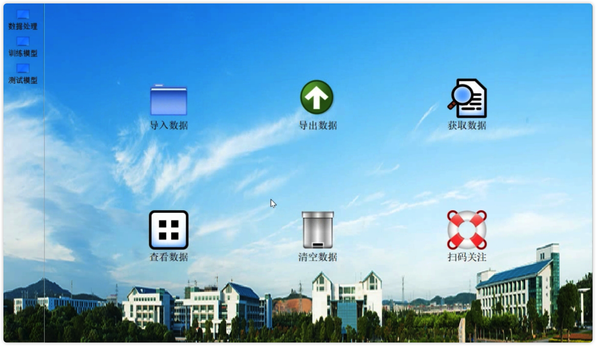
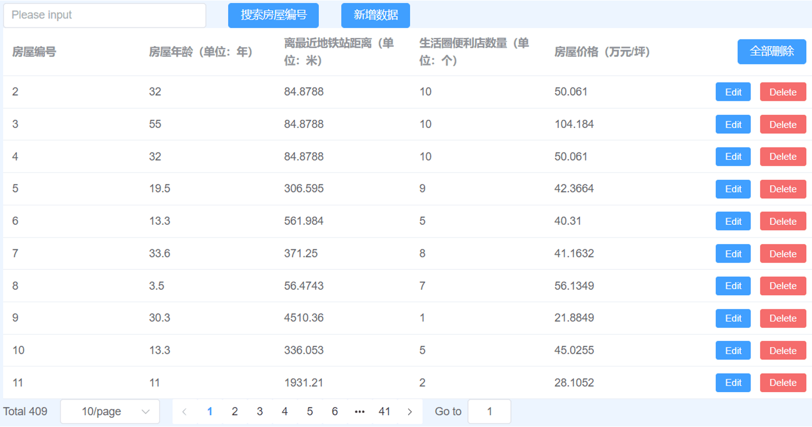

# 一键式机器学习预测系统

[](https://megengine.org.cn/doc/stable/zh/) [](https://megengine.org.cn/doc/stable/en/) [](https://crowdin.com/project/megengine) 


本仓库为三周实训项目(11月28日~12月16日)————南京工业职业技术大学人工智能专业大二上学期

<p align="center">
  
  
</p>


## 综述

该项目存在三个数据集，我们进行了数据处理，并选择了最优的机器学习算法算法，并制作基于PyQt的自动导入数据，自动完成模型训练的exe软件——一键式机器学习预测系统。同时还制作批量导入数据的预测的flask和django的web应用，对预处理难、调参难、部署难提供了相应的解决方案。以及一份93页的答辩ppt（动态动态效果）

学生群体划分：聚类

房价预测：AutoGluon技术

癌症复发诊断：决策树

## 安装和环境配置

在开始运行本仓库下的代码之前，用户需要通过以下步骤来配置本地环境：

创建虚拟环境

1. 克隆仓库

```bash
git clone https://github.com/jarrycf/ML-training
```

2. 安装依赖包

on win💻

```bash
pip3 install --user -r req.txt
```

On Mac 

```base
pip3 install --user -r requirements.txt
```

“mainFrame.pyy”中使用的“必需”软件包中使用到版本是： 

* `PyMySQL>=1.0.2` 
* `pandas>=1.5.2` 
* `PyQt5>=5.15.7` 
* `Pillow>=9.3.0` 
* `joblib>=1.2.0`
* `numpy==1.23.5`
* `pyinstaller==5.6.2`
* `scipy` &gt;= `'1.4.1'`
* `pandas` &gt;= `'1.0.1'`
* `scikit-learn` &gt;= `'0.22.1'`
* `matplotlib` &gt;= `'3.1.3'`
* `seaborn` &gt;= `'0.10.0'`
* `prettytable` &gt;= `'2.0.0'`
* `tqdm` &gt;= `'4.56.2'`

## 应用功能介绍

基本功能


### 数据处理

导入数据：支持csv、excal、txt

导出数据：可对预测结果以csv文件的格式导出

获取数据：在线查找AI studio 和 Kaggle 各类数据集

查看数据：

清空数据：

扫码关注：请我们喝咖啡

### 训练模型

### 测试模型


## 目录介绍

模型选择

```python
.
├── README.md   
├── Test.ipynb
├── data
│   ├── House_Training.csv
│   ├── House_Training_index.csv
│   ├── Score_train.csv
│   ├── breast-cancer-train.csv
│   ├── breast-cancer-train.txt
│   ├── jiazhou_test.csv
│   └── test.csv.zip
├── dump
│   └── my_ridge.pkl
├── requirements.txt
├── 房价预测_1.ipynb............................................{正规方程、随机梯度下降、岭回归}
├── 房价预测_2.ipynb............................................................{AutoGluon}
├── 学生群体划分.ipynb........................................................{聚类、层次聚类}
├── test.py......................................................................{代码测试}
├── 癌症复发诊断_1.ipynb.............................{随机森林、决策树、SVM、逻辑回归、梯度提升树}
└── 癌症复发诊断_2.ipynb

15 directories, 51 files
```


PyQt实现

表操作：QTableWidget

主布局：QStackedLayout

```py
├── frames
│   ├── __pycache__
│   ├── homeframe
│   │   ├── dataProcess.py...................................................{数据预处理实现}
│   │   ├── homeFrame.py......................................................{主界面的实现}
│   │   ├── labelFrame.py....................................................{评估指标的实现}
│   │   ├── selectModel.py...................................................{模型选择的实现}
│   │   ├── tableFrame.py....................................................{表格操作的实现}
│   │   └── trainModel.py.................................................{模型训练预测的实现}
├── ui.........................................................................{UI设计模块}
└── utils
    ├── homeModelTrain........................................................{房价预测模块}
    │   │   └── homeModelTrain.cpython-39.pyc
    │   └── homeModelTrain.py
    ├── medicalModelTrain..................................................{癌症复发诊断模块}
    │   ├── __pycache__
    │   │   └── medicalModelTrain.cpython-39.pyc
    │   └── medicalModelTrain.py
    └── stuModelTrain......................................................{学生群体划分模块}


```

```py
├── ui.........................................................................{UI设计模块}
└── utils
    ├── homeModelTrain........................................................{房价预测模块}
    │   │   └── homeModelTrain.cpython-39.pyc
    │   └── homeModelTrain.py
    ├── medicalModelTrain..................................................{癌症复发诊断模块}
    │   ├── __pycache__
    │   │   └── medicalModelTrain.cpython-39.pyc
    │   └── medicalModelTrain.py
    └── stuModelTrain......................................................{学生群体划分模块}


29 directories, 101 files
```

主界面


web模型部署实现：


前端：Vite（vue脚手架）+ElementPlus（组件库）+Axios（HTTP请求数据库）

```py
AIshow1.0\
|----index.html
|----package-lock.json..............................................{记录版本号、下载地址、依赖}
|----package.json........................................................{对项目或模块保存描述}
|----public\...............................................................{创建静态资源：图片}
|----src\.........................................................................{源文件目录}
|    |----App.vue....................................................................{主组件}
|    |----assets\..................................................................{存放资源}
|    |    |----img.png
|    |----components\...........................................................{vue组件目录}
|    |    |----HOME.vue.
|    |    |----MEDICAL.vue
|    |    |----STU.vue
|    |----main.js..............................................................{首页配置文件}
|    |----router.js............................................................{路由配置文件}
|    |----style.css............................................................{css样式文件}
|----vite.config.js.............................................................{vue配置文件}
```


后端：flask+Navicat

```py
AIshow1.0\
|----data\.............................................................................{数据}
|----model\.....................................................................{机器学习模型}
|    |----housePricePre.pkl.....................................................{房屋预测模型}
|----static\.......................................................................{静态资源}
|    |----index.css
|    |----index.js
|----templates\....................................................................{模板文件}
|    |----index.html
|----utils\....{工具包}
|    |----modelHelper.py...........................................................{模型预测}
|    |----sqlHelper.py............................................................{数据库操作}
|    |----strFormatHelper.py....................................................{字符串格式化}
|----view\......................................................................{首页配置文件}
|    |----homeview.py........................................................{房价预测页面接口}
|    |----medicalview.py.....................................................{癌症诊断页面接口}
|    |----stuview.py.....................................................{学生成绩分类页面文件}
|----__init__.py
```


表格绘制方式

1. 计算每个灰度值的累积频率：对于每个灰度值 $x$，其累积频率 $c(x)$ 可以通过如下方式计算：

$$ c(x) = \sum_{i=0}^{x} p(i) $$

其中，$p(i)$ 是灰度值为 $i$ 的像素数占总像素数的比例。

在上面的例子中，我们可以计算出以下累积频率：

| 灰度值   | 0    | 1    | 2    | 3    | 4    | 5    | 6    | 7    | 8    | 9    |
| -------- | ---- | ---- | ---- | ---- | ---- | ---- | ---- | ---- | ---- | ---- |
| 累积频率 | 0.01 | 0.04 | 0.09 | 0.19 | 0.34 | 0.54 | 0.74 | 0.89 | 0.99 | 1.00 |

1. 计算每个灰度值的新灰度值：对于每个灰度值 $x$，它的新灰度值 $y$ 可以通过如下方式计算：

$$ y = \lfloor L \times c(x) \rfloor $$

其中，$L$ 是灰度级别，$\lfloor \cdot \rfloor$ 表示下取整。

在上面的例子中，我们可以计算出以下新灰度值：

| 灰度值   | 0    | 1    | 2    | 3    | 4    | 5    | 6    | 7    | 8    | 9    |
| -------- | ---- | ---- | ---- | ---- | ---- | ---- | ---- | ---- | ---- | ---- |
| 新灰度值 | 0    | 0    | 1    | 1    | 2    | 3    | 4    | 4    | 5    | 5    |


